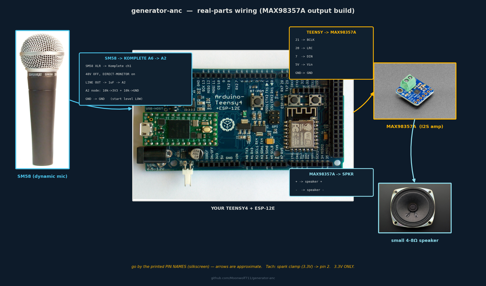
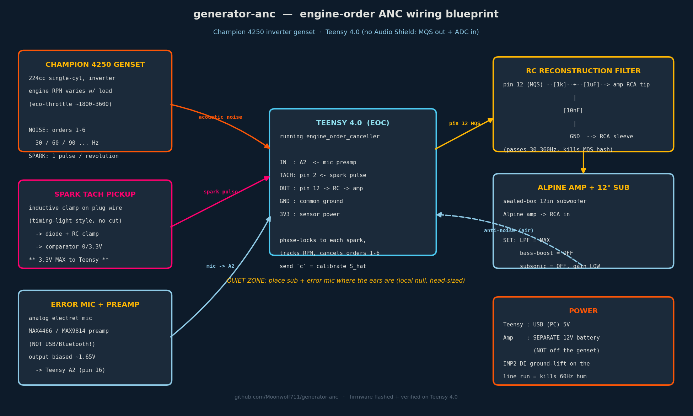
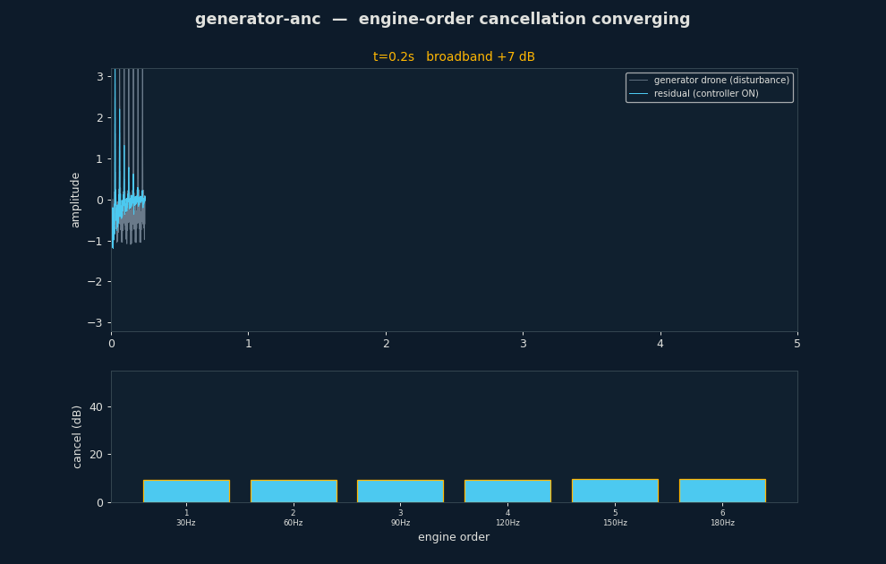

# generator-anc

Real-time **engine-order active noise cancellation** for generators / gensets, in portable C++17.

A tach-synced narrowband Filtered-x LMS controller that cancels the firing fundamental and its
harmonics — the dominant, periodic part of generator noise. The DSP core is header-only, allocation-free
in steady state, and **trig-free in the per-sample hot loop** (phasor recurrence), so it drops onto a
Teensy / STM32 / Pi as-is.

## Build blueprint & demo

Bench wiring — real parts, every pin (SM58→Komplete mic, MAX98357A I2S output):



System overview:



Engine-order cancellation converging (synthetic, phase-coherent — what the tach makes real):



## Hardware, firmware & phone cockpit

The DSP core ships as real firmware with a live, browser-based control surface:

- **Teensy 4.0 firmware** (`firmware/generator_anc_teensy/`) — the canceller as an `AudioStream` node,
  a cycle-accurate **spark-tach ISR** (re-seats the oscillator phase on every spark), an engine-off
  **Ŝ secondary-path calibration**, and serial command + telemetry.
- **ESP-12E cockpit** (`firmware/esp12e_dashboard/`) — a self-contained SoftAP web app (no CDN, no
  internet). Join WiFi `generator-anc` → `http://192.168.4.1` for live RPM / tach-lock / per-order
  effort / Ŝ status, with **write-back** sliders (orders, μ, output gain) and Calibrate/Run/Stop that
  tune the running controller.

**Start here:** [`docs/bring-up-runbook.md`](docs/bring-up-runbook.md) — one ordered procedure from
parts to cancelling. Stage docs: [spark tach](docs/spark-tach.md) · [output stage](docs/output-stage.md).

## Why engine-order, not broadband ANC

Generator noise is periodic: a firing fundamental `f0` (set by RPM) plus harmonics. With a tach you
synthesize the exact reference internally, and two things fall out:

- the secondary path (anti-noise speaker → error mic) collapses, at each harmonic, to **one complex
  coefficient** — `|S(h·f0)|` and `∠S(h·f0)` — instead of a full adaptive FIR. Trivial to identify, robust.
- each order is a **2-tap (cos/sin) adaptive filter** → a handful of MACs per sample, MCU-friendly,
  and the cancellation at the harmonics is far deeper than broadband FxLMS reaches.

## The controller

`include/eoc/engine_order_canceller.hpp` — one class:

```cpp
eoc::EngineOrderCanceller c(fs, /*orders*/8, /*mu*/0.05);
c.setFrequency(f0Hz);                       // from the tach; recomputes phasor steps (trig here, not in process)
c.setSecondaryPath(order, mag, phaseRad);   // per-order |S| and ∠S, identified once per machine
float y = c.process(errorMicSample);        // returns anti-noise; trig-free, no allocation
```

Update law (leaky, per-order power-normalized FxLMS), with `e = d + S{y}` measured at the error mic:

```
x' = S_hat{reference}                       // filtered reference (the "Fx")
w  <- (1 - leak)·w  -  mu_eff · e · x'       // drives S{y} -> -d
```

## Build & run

```bash
cmake -S . -B build -DCMAKE_BUILD_TYPE=Release
cmake --build build -j
./build/eoc_tests            # 9/9 unit tests
./build/genset_sim           # synthetic genset validation -> outputs/
```

Builds `-Wall -Wextra -Wpedantic` clean, statically linked (no runtime DLLs). Debug builds add ASan/UBSan.

## Results (synthetic genset, realistic Ŝ: +10% mag, +0.08 rad error)

| order | freq | cancellation |
|---|---|---|
| 1–8 | 120–960 Hz | **+56 to +86 dB** |
| broadband (incl. noise floor) | | +24 dB |

Broadband is limited by the un-modeled noise floor — by design, engine-order ANC removes the *tones*,
not the hiss. Unit tests also confirm: a 180°-wrong `Ŝ` does **not** falsely converge, and the controller
tracks an RPM change.

## The tach is not optional (finding from a real recording)

A real generator recording was analyzed (`tasks/todo.md` has the detail). The decisive result:

> Engine-order ANC requires a clean **phase reference** — a tach. A single noise recording does not
> contain one. A free-running oscillator at an *estimated* f0 decorrelates from the real, cycle-to-cycle
> jittering engine phase, and cancellation collapses. The synthetic sim cancels deeply precisely because
> its reference is phase-coherent by construction.

So the hardware needs a **tach pickup** for engine angle plus a co-located **error mic** — both now
built and documented: the spark-tach front-end ([docs/spark-tach.md](docs/spark-tach.md)) feeds the
firmware's tach ISR, and the [bring-up runbook](docs/bring-up-runbook.md) walks the full rig. The desk-fan
experiment (`tools/fan_anc_test.py`) demonstrates the finding empirically: a clean tone cancels −22 dB,
the *same tone drifting* with a fixed reference only −2 dB, and back to −22 dB once a true instantaneous
frequency (a tach) drives it.

## Layout

```
include/eoc/engine_order_canceller.hpp   the controller (header-only, embeddable)
tests/test_eoc.cpp + minitest.hpp        unit tests (zero-dep harness)
sim/genset_sim.cpp                       synthetic genset validation
sim/replay_recording.cpp + wav.hpp       run against a real WAV (needs a tach for true cancellation)
tasks/todo.md                            plan, status, and the tach finding
```

## Limitations / next

- Modeled (not measured) secondary path; feed-forward, tach-referenced; fixed step.
- To cancel a real unit: capture tach + simultaneous error-mic audio, tune per-order `Ŝ`, run live.
- Roadmap: tach-edge ISR phase advance, fixed-point MCU port, frequency-table `Ŝ` for RPM sweeps.
